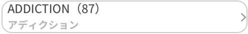

# Graphql-Fragment-Design

A spider chart sample that uses [Macaw](https://github.com/exyte/macaw) library.


## Design - 1

### base Fragment
```swift
// MARK: - Fragment
fragment BrandSimple on Brand {
    id
    name
    nameJaKana
}

fragment BrandImagePath on Brand {
    imagePath
}

fragment BrandItemCount on Brand {
    itemConnection {
        totalCount
    }
}

fragment BrandReviewCount on Brand {
    reviewConnection {
        totalCount
    }
}
```

```swift
// MARK: - Fragment
fragment BrandListSimpleView on Brand {
    ...BrandSimple
    ...BrandItemCount
}
```


```swift
fragment BrandListView on Brand {
    ...BrandSimple
    ...BrandImagePath
    ...BrandReviewCount
}
```


```swift
fragment BrandListView on Brand {
    ...BrandSimple
    ...BrandImagePath
    ...BrandItemCount
    ...BrandReviewCount
}

```

### Usage

```swift
extension BrandSimple {
}

extension BrandImagePath {
    var imageUrl: URL? {
        if let imagePath = imagePath, let imageUrl = URL(imagePath: imagePath) {
            return imageUrl
        }
        return nil
    }
}


extension BrandItemCount {
    var itemCount: Int {
        return itemConnection.totalCount
    }
}

extension BrandReviewCount {
    var reviewCount: Int {
        return reviewConnection?.totalCount ?? 0
    }
}
```
