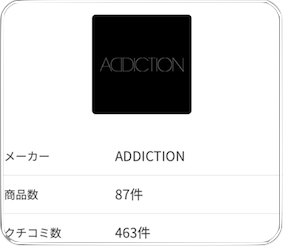

# Graphql-Fragment-Design

If you use [graphql](https://graphql.org/) as your service's api server, you can try to use the following methods to design your fragment.

## Design Method - 1

If you have a Brand object, you need to show the different info of Brand according to the Views.
### The parts of fragment
```graphql
fragment BrandSimple on Brand {
    id
    name
    nameJaKana
}

fragment BrandImagePath on Brand {
    imagePath
}

fragment BrandItemCount on Brand {
    itemConnection {
        totalCount
    }
}

fragment BrandReviewCount on Brand {
    reviewConnection {
        totalCount
    }
}
```
### The first view

```graphql
fragment BrandListSimpleView on Brand {
    ...BrandSimple
    ...BrandItemCount
}
```

### The second view

```graphql
fragment BrandListView on Brand {
    ...BrandSimple
    ...BrandImagePath
    ...BrandReviewCount
}
```

### The third view

```graphql
fragment BrandListView on Brand {
    ...BrandSimple
    ...BrandImagePath
    ...BrandItemCount
    ...BrandReviewCount
}

```

### Usage

#### You can use extension to make your functions, and you only need to write once.
```swift
extension BrandSimple {
}

extension BrandImagePath {
    var imageUrl: URL? {
        if let imagePath = imagePath, let imageUrl = URL(imagePath: imagePath) {
            return imageUrl
        }
        return nil
    }
}

extension BrandItemCount {
    var itemCount: Int {
        return itemConnection.totalCount
    }
}

extension BrandReviewCount {
    var reviewCount: Int {
        return reviewConnection?.totalCount ?? 0
    }
}

extension BrandListView {
    var imageUrl: URL? {
        return self.fragments.brandImagePath.imageUrl
    }

    var itemCount: Int {
        return self.fragments.brandItemCount.itemCount
    }

    var reviewCount: Int {
        return self.fragments.brandReviewCount.reviewCount
    }
}
```

## Design Method - 2

If you have a Button object, you need to show or hide by the login status of user.
### The parts of fragment
```graphql
fragment UserSimple on User {
    id
    name
    age
    ...
}

fragment UserFollowRelation on User {
    isFollowing: fetchState @include(if: $login) {
        isFollowing
    }
}
```

### The view


```graphql
fragment UserListView on User {
    ...UserSimple
    ...UserFollowRelation
}

query UserConnection($login: Boolean = true) {
    userConnection {
        edges {
            node {
                ...UserListView
            }
        }
    }
}
```

### Usage

```swift
extension UserFollowRelation {
    var isFollowing: Bool {
        return self.isFollowing
    }
}

extension UserListView {
    var isFollowing: Bool {
        return self.fragments.userFollowRelation.isFollowing
    }
}
```
